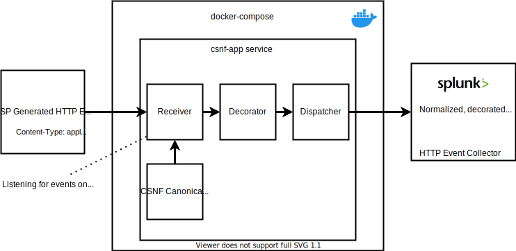

**The CSNF demo-service runs on Docker**

# Changes

To see what's changed in the current version, see [CHANGES.md](https://github.com/onug/CSNF/blob/main/demo-service/CHANGES.md)

# Demo Overview

The CSNF demo comes packaged with a Dockerfile. Please see the next section for instructions on how to set up Docker on your machine. The architecture for the CSNF demo service that gets deployed with Docker is shown below.



# Download and install Docker

This tutorial assumes you have a current version of Docker installed on your machine. If you do not have Docker installed, head on over to the Docker documentation [getting started](https://docs.docker.com/get-started/). For Docker Desktop installation instructions, see Install Docker [Desktop on Mac](https://docs.docker.com/desktop/mac/install/) and Install [Docker Desktop](https://docs.docker.com/desktop/windows/install/) on Windows.

# Running the demo-service with Docker

To make use of the repo, you'll need to clone it locally - if you don't know how to do that, refer to the Github [Cloning a repository](https://docs.github.com/en/github/creating-cloning-and-archiving-repositories/cloning-a-repository) documentation.

1. Clone the repo and change to the demo-service directory

```bash
git clone https://github.com/onug/CSNF.git && cd CSNF/demo-service
```

**Note: The demo currently requires that you have an instance of  Splunk available**

2. Update the values below to match your Splunk instance. The Docker application will look for environment variables to be in a local file named **.env**

   In order to configure the demo-service to dispatch events to Splunk you will need to provide information about your Splunk instance. Create a file with the name .env and place that in the demo-service folder.  Add the **SPLUNK_URL** and **SPLUNK_TOKEN** values to this file. The bash script below can also be used just make sure to replace the environment variable values with your own.

```bash
touch .env && echo "SPLUNK_URL=http://splunk:8088" >> .env && echo "SPLUNK_TOKEN=fac44edf-79a4-409b-938d-1982259bf523" >> .env

cat .env
SPLUNK_URL=http://splunk:8088
SPLUNK_TOKEN=fac44edf-79a4-409b-938d-1982259bf523
```

3. Run docker-compose from the CSNF/demo-service folder. 

```bash
docker-compose up -d
Creating network "demo-service_default" with the default driver
Creating demo-service_csnf-app_1 ... done
```

4. Verify that the application is running using the docker ps command. 

```bash
docker ps
CONTAINER ID   IMAGE                   COMMAND                  CREATED       STATUS       PORTS                                       NAMES
79ad66dbb733   demo-service_csnf-app   "docker-entrypoint.s…"   4 hours ago   Up 4 hours   0.0.0.0:3000->3000/tcp, :::3000->3000/tcp   demo-service_csnf-app_1
```

5. Confirm that the demo-service is listening on port 3000 as well as monitoring requests sent to the demo-service by following the logs in a terminal window.

```bash
docker logs -f demo-service_csnf-app_1
The SPLUNK_URL is http://splunk:8088
[2021-11-30T23:53:56.862] [INFO] [csnf dictionary-manager] - dictionary aquasec:0.0.1 registered
[2021-11-30T23:53:56.863] [INFO] [csnf decorator-manager] - decorator dockerhub registered
[2021-11-30T23:53:56.865] [INFO] server - listening on http://localhost:3000
```

# Running the demo-service on Google Cloud Run

Cloud Run is a managed compute platform that enables you to run containers that are invocable via requests or events. Cloud Run is serverless: it abstracts away all infrastructure management, so you can focus on building and deploying applications.

1. Follow steps #1 and #2 above in the section Running the demo-service with Docker

2. Ideally, we can use the docker build command to build an image from our Dockerfile, but because we intend to deploy the application to Google Cloud Platform, we need to use Cloud Build which is a dedicated service for building container images on GCP.

   ```bash
   # retrieve project-id of active project
   PROJECT="$(gcloud config get-value project)"
   
   # build docker/container image
   gcloud builds submit --tag gcr.io/"${PROJECT}"/demo-service
   
   
   DIR="$(dirname "$0")"
   . "${DIR}/config"
   
   ```

   


## Accessing the demo-service

Now that the demo-service is listening for requests on port 3000 its almost time to send a mock event to the demo-service. 

| Service      | URL                   | Purpose                 |
| ------------ | --------------------- | ----------------------- |
| demo-service | http://localhost:3000 | The CSNF event receiver |

The demo-service is configured to receive an HTTP event, normalize the event using the canonical model and forward the normalized event to an endpoint. In this example we are using Splunk as the event collector. An HTTP client is required to make a HTTP request to the demo-service. 

6. The samples folder contains a payload fthat can be used to test the demo-service. Open a new terminal window and run the following curl command from the ./demo-service directory. If you would rather use Postman, there is also a sample Postman collection that you can import into Postman from the samples folder.

```bash
curl -X POST -H "Content-Type: application/json" -d @./samples/aquasec.json http://localhost:3000/receivers/aquasec
```

7. You should still be following the logs from the demo-service in your other terminal. If everything worked correctly you should see log messages that confirm that the event has been extracted, interpreted and dispatched to Splunk. 

```bash
[2021-11-30T23:53:56.865] [INFO] server - listening on http://localhost:3000
[2021-12-01T00:18:22.284] [DEBUG] aquasec-receiver - extracting and interpreting event
[2021-12-01T00:18:22.677] [DEBUG] aquasec-receiver - dispatching
[2021-12-01T00:18:22.705] [DEBUG] splunk-dispatcher - event successfully dispatched
```

8. When you are done you can stop the demo-service with the docker-compose down command.

```
docker-compose down -v
Stopping demo-service_csnf-app_1 ... done
Removing demo-service_csnf-app_1 ... done
Removing network demo-service_default
```


## Contributing to the csnf-demo project

If you want to contribute to the repo, see the [CONTRIBUTING.md](https://github.com/onug/CSNF/blob/main/demo-service/CONTRIBUTING.md) file.

# Reference Material

